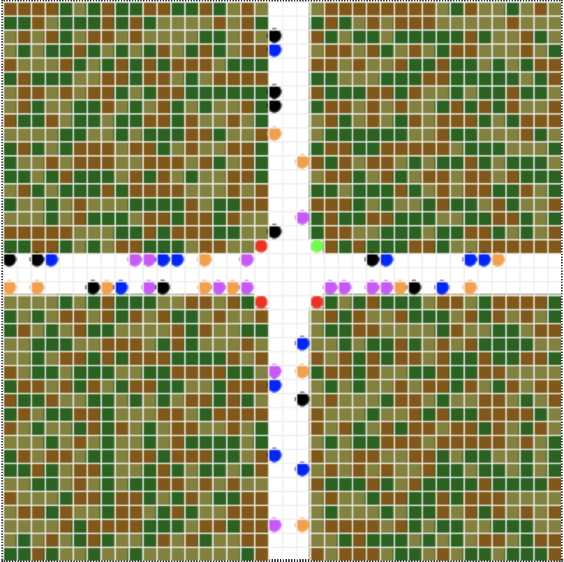
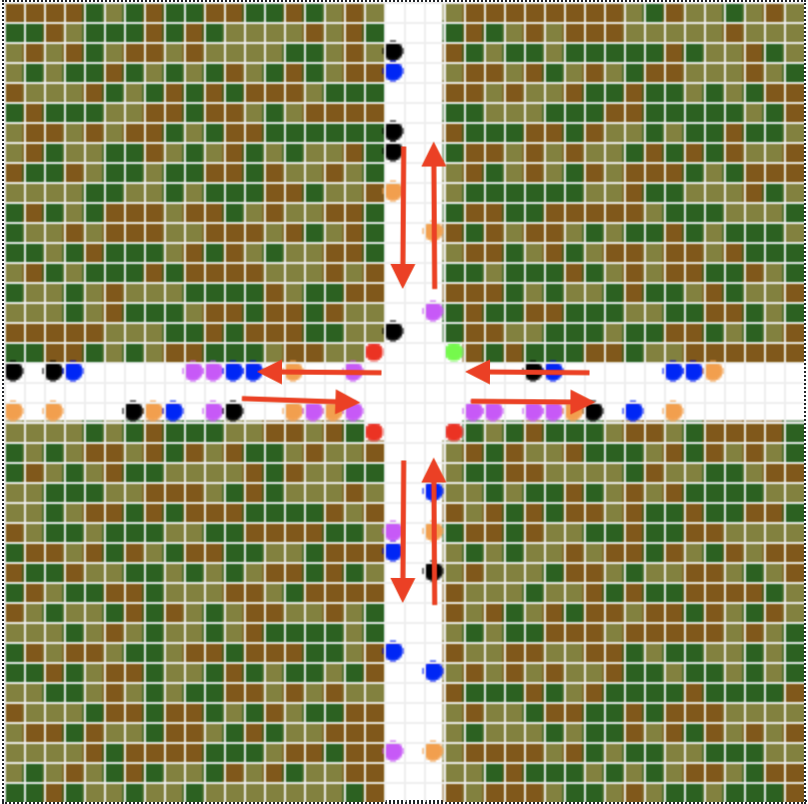

## Multiagents Traffic Light Intersection

---
## Description
---
  The program simulates a traffic intersection controlled by smart traffic lights and implements different conditions with the objetive of optimizing the flow of the traffic. 

  Among this conditions, we include:
  - Turning red when a lane has no incoming cars
  - Prioritizing the lanes which have more cars waiting in line

---
## Agents
---

### **Crossroad(Model)**
In the simulation the model operates as a super agent and is aware of the cars present in the simulation, the traffic lights and the amount of cars witing in each lane.

As seen in the image below, the model consists of an intersection where each street has 2 lanes, the lanes positioned to the right side relative to the intersection is the lane where cars approach the intersection, and the left lane is where the cars are moving away from the intersection.

States: 
* Number of agents
* Running
* width
* height
* centre_bounds
* grid
* schedule
* traffic time
* no car zone (intersection point)
* centre
* possible turns
* traffic light time counter
* position of traffic lights
* traffic counter
* streets

Perceptions:
* Cars present in the simulation
* position of traffic lights
* traffic counter
* streets

Actions:
* Create cars and assign random color and directions
* Changes traffic lights color

---
### **Car**
The car agent simulates the basic functionality of a car in the context of crossing an intersection and is capable of turning in any random directions once it arrives at the intersection, including making a U turn. This helps our simulation because we have cars with behaviour we won't be able to predict and the smart traffic lights must control in an efficient way the crossing of cars. This agent helps us create uncertainty and the turning rate state enables us to test the smart traffic lights with a more extreme case of turning rates.
    
States: 
* direction
* color
* waiting
* turning rate
* next_pos (next position)

Perceptions:
* Car is near traffic light and what color it displays
* Car is before crossroad
* Car can move to the next cell in the current direction or not

Actions:
* Car can move in any direction when it arrives to the intersection (including a U turn)
* Car stops when it is near a traffic light that is red or it has cars ahead

---
### **Traffic Light**
The perceptions and actions of the traffic light are managed by the Crossroad Model which operates as a super agent and manages all traffic lights base on the information it perceives in the traffic

States: 
* color

  
---
### **Field**

  The field agent does not interact with it's environment based on perceived information. 

  It's a decorator that helps the graphical visualization of the program by coloring the field, so the streets and cars displayed in the simulation can be the main focus of attention.
  
States: 
* color

---
## Interaction Between Agents of the same type
---
### **Car**
The car agent follows it's direction and turns in a random direction once it hits the crossroad. The only interactions it has with other car agents is noticing them to avoid a crash.

### **Traffic Light**
Traffic lights don't interact with each other directly. The are puppeteered by the crossroad model to operate traffic in each lane of the intersection.

---
## Environment
---
* **agents.py:** Agents implementation
* **model.py:** Super agent and model implementation
* **run.py:** launches de server
* **server.py:** Agents initialization and server settingd
* **.idea:** Data visualization

---
## Variables and parameters
---
The variables and parameters of the simulation can be adjusted from the graphical user interface of the visualization, which are:
* Number of cars
* Half Length(dimentions of map)
* Traffic timer
* Turning rate (Turning rate of cars)

---
## Simulation Process
---
The simulation process consists of running the run.py file, which launches the server and the server.py is the file that instantiates the intersection and the agents.

Then a link will appear on the terminal and the simulation would be visible on a web browser.

---
## Results
---
The traffic was optimized by making the lanes with more traffic a priority and allowing a traffic light change when there was no traffic in a lane and the traffic light color was green.

---
### Link to Repository: https://github.com/davidmartinezhi/Traffic-Intersection
---